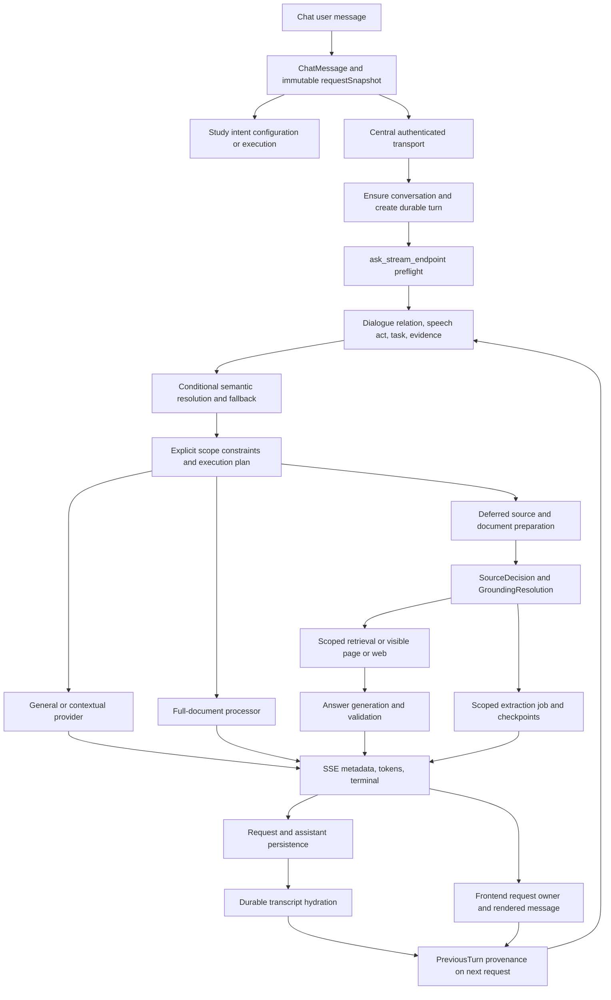

# AI request and reliability architecture

Code review snapshot: `d35b9e9b01b3cb2f0c99ddd717dac1e4216066c7`, 2026-09-10. This describes implemented ownership and boundaries; it is not proof that every path has passed live E2E.

## Browser ownership and transport

`frontend/js/features/chatbot-new/shell.ts::streamAiReply` owns the assistant placeholder, AbortController, generation lifecycle, and captured request context. `ChatMessage.requestSnapshot` preserves the original user text, course, selected source IDs, source mode, viewer identity, and grounding request. Retry reuses the submitted intent; regenerate creates another stable assistant variant with a cloned snapshot.

`ragEligibility` prepares eligible document/viewer context. `streamFromAskStream` captures source parameters before asynchronous PDF capture, validates captured viewer identity against submitted context, sends the request through `frontend/js/services/authenticated-fetch.ts`, and consumes real SSE via `SseParser`. Typed transport failures carry useful partial text. Terminal handling removes commentary and releases request ownership so another message can proceed.

The central authenticated transport refreshes expiring tokens, coordinates concurrent refreshes, and retries safe server-rejected requests with the replacement token. The browser adapter distinguishes a rejected token from a newer token already installed by another request. Feature-specific calls still need audit coverage; the existence of this service alone does not prove every fetch uses it.

## Meaning, evidence, and execution

`backend/python-ai/app/routers/stream.py::ask_stream_endpoint` authenticates ownership, normalizes `GroundingRequest`, resolves requested document access, and derives dialogue resolution before choosing execution. `services/dialogue_state.py` separates relation/speech act/task family from evidence requirement and uses previous answer provenance for clarification versus fresh verification. Ambiguous contextual requests may call the semantic model; invalid or failed output uses bounded fallback.

Preflight applies explicit Internet and selected-document constraints before `services/execution_router.py::resolve_execution_plan`. The execution plan selects a lane such as fast general/contextual/grounded, standard RAG, visible page, full document, deep reasoning, or web. A preliminary lane is not the final evidence source: deferred preparation can further classify source policy.

`_prepare_ask_stream_response` builds the `SourceDecision` with `services/source_router.py::classify_source_scope`, validates authorized documents and readiness, and binds active revisions in `GroundingResolution`. `GroundingRequest.retrievalScope` is the user's allowed course/document set; `viewerContext` describes the visible document/page; `documentAccess` chooses relevance, visible-page, or exhaustive processing. These are separate axes and should not overwrite one another.

Fast general/contextual answers use `services/general_answer.py::stream_general_answer`. Grounded clarification can reuse prior answer evidence without new retrieval while retaining its grounded provenance. Deferred grounded answers use `retrieve_routed_chunks` and `services/answer_stream.py::stream_answer`; web and page-reading branches supply their corresponding evidence. Explicit grounding failures require typed recovery rather than silent general substitution.

## Documents and exhaustive work

Indexing stores canonical physical-page manifests and active revision identity. Document health checks compare metadata with available pages/chunks. Retrieval reads within authorized document scope and the chosen revision. `services/index_manifest.py` supplies expected-versus-processed coverage checks.

There are two distinct exhaustive mechanisms. `services/full_document_processing.py::process_full_documents` maps canonical expected pages in batches and synthesizes the results; `exhaustive_document_stream` invokes it in a thread and bridges progress into SSE. `services/scoped_job_store.py` and `scoped_job_worker.py` handle durable scoped-extraction jobs, leases, manifests, items, checkpoints, and persisted results. A checkpoint guarantee demonstrated for extraction must not be attributed automatically to full-document summaries.

Scoped persistence uses `complete_document_jobs`, `request_scope_manifests`, `request_scope_items`, `scope_job_events`, and `document_logical_units`. Status/resume/retry endpoints in `stream.py` reconnect the browser to those jobs and their request bindings.

## Conversation persistence and next-turn evidence

`services/conversation_store.py::ensure_durable_conversation` maps a client chat to an owned `ai_chat_conversations` row and idempotently stores user messages. `create_durable_tutor_turn` calls the `create_ai_tutor_turn` RPC to atomically create the user turn, assistant placeholder, and `ai_tutor_requests` record. `update_tutor_request` records progress/terminal status and assistant content, with answer provenance retained under the existing request snapshot.

`get_durable_conversation_messages` joins request identity, snapshot, commentary, scoped-job binding, and answer provenance onto transcript rows. `shell.ts::hydrateDurableTranscript` restores them. The next request transmits previous turn provenance (`answerMode`, `groundingMode`, `sourceScope`) independently from the lane that generated a clarification. Preserving this distinction prevents a grounded answer from becoming general merely because it was restated conversationally.

## Generated study tools and Saved

`shell.ts::handleIntentRoute` captures the submitted course/source context and routes explicit study-tool requests. Flashcards, ExamForge, and Deep Learn can open a source-aware configuration marker with awaiting-confirmation state. Their service/API generation and validation paths are separate from ordinary answer streaming. ExamForge's exact question/answer verification and persisted session identity are distinct from professor-style mock exam prose.

Saved replies use their synchronization engine and pending/tombstone states to recover offline create/delete operations. Generated tools persist feature-specific records and reopen by stored identity. Chat persistence, Saved reply persistence, and generated-tool persistence are separate boundaries; success in one does not establish the others.

## Reviewer focus

Trace one request ID and its captured source context across async browser work, preflight, evidence, final source decision, terminal SSE, durable assistant row, and next-turn provenance. For study tools and exhaustive work, additionally follow the artifact/job ID into persistence and reopen/resume. The accompanying coverage matrices identify which links are runtime-tested and which remain unverified.
